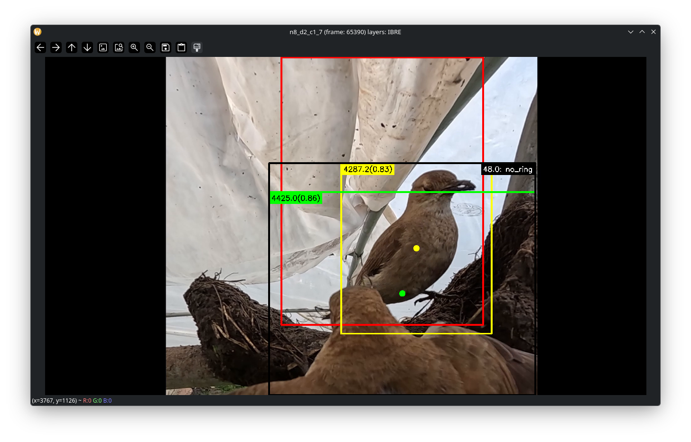

Animator
========

Overview
--------

The animator provides an interactive OpenCV window for reviewing classified video scenes.
It overlays YOLO detections, bird tracks, rings, and event bounding boxes on top of the original
video frame so you can inspect both raw detections and classification results.

.. note:: The OpenCV window is currently leading to numerous bugs and will probably be converted to a QT window at some
    point.

What the overlays mean
----------------------

The animator draws overlays in four layers, from bottom to top:

- ``Ignored`` (red): ignored detections that are not part of the bird / ring / event pipeline.
- ``Birds`` (green / yellow): detected bird bounding boxes. Green indicates a ``real`` bird box; yellow indicates a non-real bird box. annotated with bounding box id and confidence.
- ``Rings`` (blue / gray): ring detections, where plastic rings are blue and metal rings are gray.
- ``Events`` (black): event bounding boxes detected by the classifier, annotated with event ID and subject.

When both bird and ring layers are enabled and local ring relationships are available, the animator also draws
connecting lines from birds to their associated rings.

Window title header
-------------------

The animator window title contains the current scene state and active layer flags.
It changes depending on whether playback is running, paused, clipped, or in frame-jump mode.

Examples:

- ``<video_name> (sleep: 33 ms) layers: IBR_`` — playing with ignored, birds, and rings visible.
- ``<video_name> (frame: 1200, Clipped) layers: I_RE`` — paused at frame 1200, clipped playback range enabled.
- ``<video_name> (jump to: 2500) layers: IBR_`` — frame jump mode is active and waiting for numeric input.

Layer status is shown as a four-character string:

- ``I`` = ignored layer visible
- ``B`` = birds layer visible
- ``R`` = rings layer visible
- ``E`` = events layer visible
- ``_`` = corresponding layer hidden

Keyboard controls
-----------------

The animator uses keyboard shortcuts for all navigation and display controls.
The window must be focused for key presses to register.

Basic playback controls:

- ``SPACE``: toggle pause/play.
- ``ESC``: quit the animator.

Frame navigation (only when paused):

- ``D``: next frame.
- ``A``: previous frame.
- ``SHIFT+D``: jump to the end of the current clip range or video.
- ``SHIFT+A``: jump to the start of the current clip range or video.
- ``E``: jump forward 1 second.
- ``SHIFT+E``: jump forward 3 seconds.
- ``Q``: jump backward 1 second.
- ``SHIFT+Q``: jump backward 3 seconds.

.. attention:: ``SHIFT+<key>`` commands do not work on all platforms

Speed control:

- ``W``: increase sleep time by 1 millisecond (slows playback).
- ``S``: decrease sleep time by 1 millisecond (speeds playback).

Clip and layer control:

- ``C``: toggle clipped playback mode on/off. When clipped, playback is restricted to the current start/end range.
- ``H``: toggle all overlay layers together.
- ``1`` / ``Numpad 1``: toggle ignored layer.
- ``2`` / ``Numpad 2``: toggle birds layer.
- ``3`` / ``Numpad 3``: toggle rings layer.
- ``4`` / ``Numpad 4``: toggle events layer.

Frame jump mode
---------------

Press ``J`` while paused to enter frame jump mode. Then:

- type digits to enter a frame number
- ``ENTER`` to jump to that frame
- ``BACKSPACE`` to remove the last digit
- ``Q`` to cancel jump mode

How to use the animator
-----------------------

Run the animation script with a video ID prefix to open the UI:

.. code-block:: console

    python run/animate.py n10_d4_c1_1_cl2

If the video ID string only contains a partial video ID, the script will match the prefix and open the first compatible 
video.

Options
-------

- ``--scale``: rescale the displayed video. Use values greater than 1 to enlarge the output.
- ``--frame``: starting frame for playback.
- ``--clip start,end``: limit playback to a specific frame range.
- ``--auto-play``: automatically start playback when the window opens.
- ``--save <path>``: save the animation to a video file instead of displaying it.

Example with options:

.. code-block:: console

    python run/animate.py n10_d4_c1_1_cl2 --scale 1.5 --frame 1200 --clip 1000,2000 --auto-play

Tips
----

- Use layer toggles to isolate events, ring detections, or bird detections when the frame becomes too busy.
- Pause playback before using navigation keys or frame jump mode for precise inspection.
- If clips are enabled, the title bar indicates ``Clipped`` and the animator will not play beyond the selected range.
